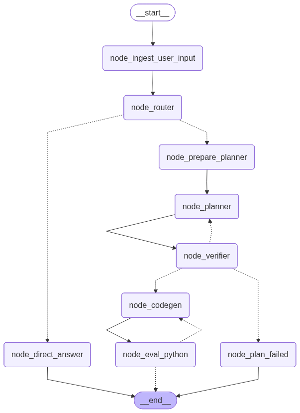

# Cobalt|Alpha

AI агент, схожий по функционалу на Wolfram|Alpha - консультирует и делает научные, инженерные, и математические расчёты.  
Проект создан исключительно в образовательных целях.

# Принцип работы

Работа агента базируется на трех паттернах

## Grounding LLMs
Для задач, где важна точность вычислений, агент не ограничивается текстовым ответом LLM. Он генерирует Python-код, выполняет его и формирует ответ на основе результата выполнения программы.


## Planner, Generator, Evaluator
Генерация программы для расчетов, происходит в три этапа. У каждого этапа свой контекст, системный промт и LLM:  
- Planner (планировщик) - формирует план расчетов на человеческом или математическом языке  
- Evaluator (верификатор) - Проверяет корректность и полноту плана. Может запросить повторное формирование плана с замечаниями
- Generator (генератор) - Генерирует Python код расчетов следуя плану. Используется более дешевая LLM с 0 температурой.     

Обычно используют последоватьльность `Planner -> Generator -> Evaluator` т.е. верификатор проверяет результат генератора. 
В данной работе решено отдать приоритет плану поэтому используется такая последовательность - `Planner -> Evaluator -> Generator`

## Artifact-centric agent architecture 
Агент работает с набором промежуточных артефактов, которые могут быть обновлены/инвалидированы в процессе диалога c пользователем.  
Далее, по workflow артефакты инжектириуются по необходимости в нужные ноды.

# Флоу работы
Роутер определяет `intent` пользователя - требует ли запрос перерасчетом или это уточняющий вопрос.



# Запуск на dev машине

В такой конфигурации агент работает на хосте, а другие зависимости - в докере  
[Чат с агентом (localhost:7860)](http://localhost:7860)  
[Phoenix (localhost:6006/projects)](http://localhost:6006/projects)  

Используемый в проекте пакетный менеджер - `uv` ([Установка uv](https://docs.astral.sh/uv/getting-started/installation/))

Необходимо создать и заполнить своими параметрами `.env`.  
Пример доступных параметров в `.env.example`.  


```shell
# создание venv
uv venv

# активация venv
source .venv/bin/activate

# скачивание зависимостей
uv sync --dev
```

Запуск доп зависимостей
```
docker compose -f docker-compose.dev.yml up
```

Запуск чата с агентом
```
uv run cobalt-alpha-ui
```

Запуск eval
```
uv run deepeval test run tests/evals/test_cases_1.py
```

# Запуск на prod машине

В такой конфигурации все работает в докере  
[Чат с агентом (localhost:7860)](http://localhost:7860)  
[Phoenix - (localhost:6006)](http://localhost:6006/projects)  


```
docker compose -f docker-compose.prod.yml up --build
```

# Ограничения 

Проблемы с безопасностью - использует питоновский eval для запуска скриптов расчета
